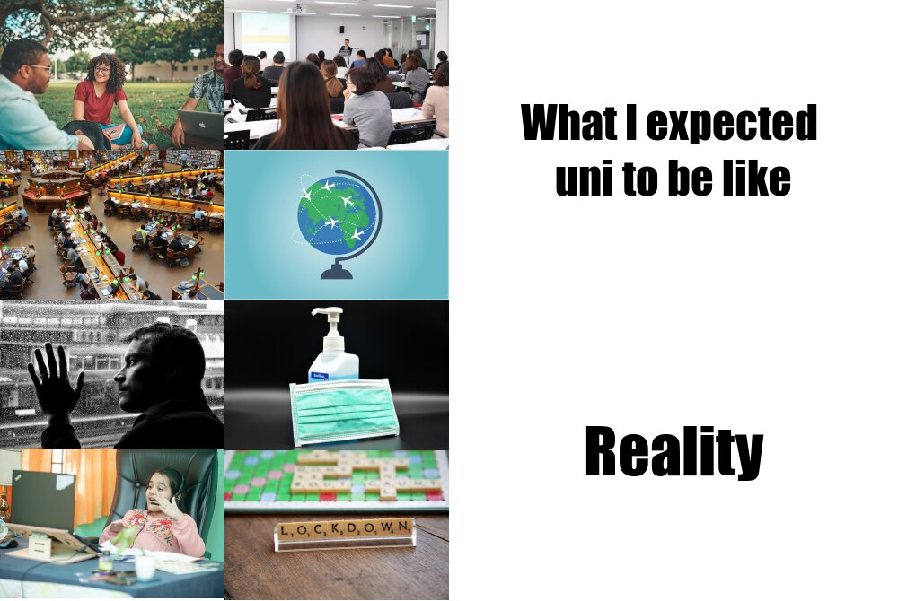

# Assignment 1 

## Some Informations About My Meme

* **What it is about**
This meme is about what I expected uni life would be like vs what my actual uni life is like.

* **how is it original**

* **Images source**
All the images I used are from [pixabay](https://pixabay.com).
	+ image1! [image1](https://cdn.pixabay.com/photo/2021/02/18/12/03/people-6027028_1280.jpg)
	+ image2
	+ image3
	+ image4
	+ image5
	+ image6
	+ image7
	+ image8


### _My Meme_



### _My Code_
#### R Code 
```r

library(magick)

# expactation images
expectation_image1 <- image_read("https://cdn.pixabay.com/photo/2021/02/18/12/03/people-6027028_1280.jpg") %>% image_scale(250)

expectation_image2 <- image_read("https://cdn.pixabay.com/photo/2016/05/18/11/25/library-1400313_1280.jpg") %>% image_scale(250)

expectation_image3 <- image_read("https://cdn.pixabay.com/photo/2019/02/10/09/21/lecture-3986809_1280.jpg") %>% image_scale(250)

expectation_image4 <- image_read("https://cdn.pixabay.com/photo/2018/05/18/16/41/globe-3411506_1280.jpg") %>% image_scale(250)

# reality images
reality_image5 <- image_read("https://cdn.pixabay.com/photo/2013/02/21/19/00/depression-84404_1280.jpg") %>% image_scale(250)

reality_image6 <- image_read("https://cdn.pixabay.com/photo/2022/01/22/03/59/student-6956172_1280.jpg") %>% image_scale(250)

reality_image7 <- image_read("https://cdn.pixabay.com/photo/2020/03/21/18/04/hand-disinfection-4954816_1280.jpg") %>% image_scale(250)

reality_image8 <- image_read("https://cdn.pixabay.com/photo/2020/05/04/19/21/lockdown-5130295_1280.jpg") %>% image_scale(250)

# texts 
expactation_text <- image_blank(width = 500, height = 335, color = "#FFFFFF") %>% 	image_annotate(text = "What I expected \nuni to be like", 
						color = "#000000", 
						size = 50, 
						font = "Impact", 
						gravity = "center")
						
reality_text <- image_blank(width = 500, height = 335, color = "#FFFFFF") %>% image_annotate(text = "Reality", 
				color = "#000000", 
				size = 70, 
				font = "Impact", 
				gravity = "center") 
			
# making the final meme				
expectation_images1 <- c(expectation_image1, expectation_image2)
e_image1 <- image_append(expectation_images1, stack = TRUE)

expectation_images2 <- c(expectation_image3, expectation_image4)
e_image2 <- image_append(expectation_images2, stack = TRUE)

reality_images1 <- c(reality_image5, reality_image6)
r_image3 <- image_append(reality_images1, stack = TRUE)

reality_images2 <- c(reality_image7, reality_image8)
r_image4 <- image_append(reality_images2, stack = TRUE)

expactation_vector <- c(e_image1, e_image2, expactation_text) %>% image_append()
  
reality_vector <- c(r_image3, r_image4, reality_text) %>% image_append()

# final mem
final_meme <- c(expactation_vector, reality_vector) %>% image_append(stack = TRUE)

# saving it as an image file
image_write(final_meme, "my_meme.png")
```
